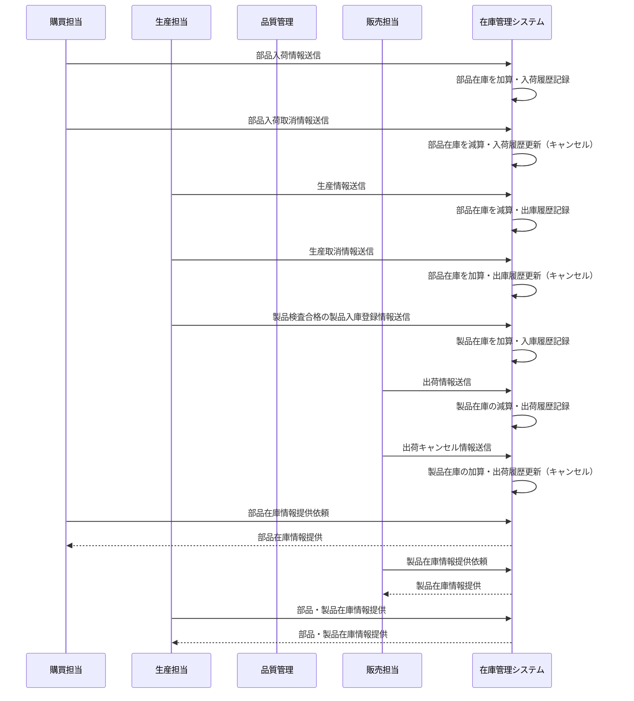

# API システム概要

## 1. 概要

ドローン在庫管理システムのアーキテクチャとシステム設計に関するドキュメントです。

## 2. アーキテクチャパターン

### 2.1 API 中心設計

本プロジェクトは**API 中心の設計**を採用しています。外部システム（購買システム、生産管理システム、販売管理システム）からのリクエストを受けて在庫管理業務を処理する REST API サーバーです。

| レイヤ       | 技術                      | 説明                              |
| ------------ | ------------------------- | --------------------------------- |
| API 層       | Spring Boot（Spring Web） | REST API の提供、外部システム連携 |
| 通信         | HTTP/REST                 | 外部システムとの標準的な API 通信 |
| ドキュメント | OpenAPI（Swagger UI）     | API 仕様の可視化と試験            |

### 2.2 API 中心設計の選択理由

1. **外部システム連携の重視**：購買・生産・販売システムとの効率的な情報連携
2. **システム間結合度の最小化**：標準的な REST API による疎結合アーキテクチャ
3. **拡張性の確保**：新しい外部システムとの連携が容易
4. **運用性の向上**：バッチ処理やイベント駆動による自動化対応

## 3. システム構成

### 3.1 全体構成

#### 3.1.1 システム構成

```
┌─────────────────┐                    ┌──────────────────────────────────────┐
│   外部システム    │                    │         在庫管理システム                │
├─────────────────┤                    ├──────────────────────────────────────┤
│                 │                    │                                      │
│ •購買システム     │◄──────────────────►│  ┌─────────────┐  ┌───────────────┐  │
│ •生産管理システム  │    REST API通信    │  │   API層      │  │  データ層      │  │
│ •販売システム     │                    │  │             │  │               │  │
│                 │                    │  │•REST API    │◄►│•MySQL DB      │  │
└─────────────────┘                    │  │•Spring Boot │  │•JPA/ORM       │  │
                                       │  │•認証・認可    │  │•トランザクション │ │
                                       │  └─────────────┘  └───────────────┘  │
                                       │                                      │
                                       └──────────────────────────────────────┘
```

#### 3.1.2 システム間の関係



### 3.2 システム構成要素

#### 3.2.1 API インターフェース層

- **外部システム連携 API**

  - RESTful API による標準的なインターフェース
  - 購買・生産・販売システムとの情報連携
  - JSON 形式のデータ交換

#### 3.2.2 ビジネス層（アプリケーション層）

- **REST API サーバー**
  - Spring Boot によるマイクロサービス
  - REST Controller による API エンドポイント提供
  - Service Layer によるビジネスロジック実装
  - Spring Security による認証・認可制御

#### 3.2.3 データアクセス層

- **データアクセス制御**
  - Spring Data JPA による ORM
  - Repository パターンによるデータアクセス
  - HikariCP による接続プール管理
  - トランザクション管理

#### 3.2.4 データベース層

- **リレーショナルデータベース**
  - MySQL 8.0 による永続化
  - マスター・トランザクション・ログ系テーブル分離

## 4. 業務プロセス詳細

### 4.1 部品の購買・入荷

- 購買システムからの入荷処理のリクエストを受けつける。
- 入荷処理のリクエストにより、既存の在庫に対しては在庫数に加算を行い、なければ登録を行う。
- リクエストによる結果は、部品入荷出荷履歴を記録する

### 4.2 部品の購買キャンセル

- 購買システムからの入荷取消情報のリクエストを受け付ける。
- 対象部品の在庫数を減算する。
- 部品入出荷履歴を記録する

### 4.3 製品製造計画の実行

- 生産システムからの製造計画に基づく使用部品情報のリクエストを受け付ける
- 必要部品を出庫し、部品の在庫数を減算
- 部品入出庫履歴を記録する

### 4.4 製品製造計画のキャンセル

- 生産システムからの製造取消情報を受信
- 対象部品の在庫数を減算
- 部品入出庫履歴を記録する

### 4.5 製造完了・製品入庫

- 生産完了した製品を品質管理部門の検査完了後、生産システムからの製造完了リクエストを受け付ける
- 製品の在庫数を加算する
- 製品入出庫履歴を記録する

### 4.6 製品の出荷

- 販売システムからの出荷情報のリクエストを受け付ける
- 製品の在庫数を減算する
- 製品入出庫履歴を記録する

### 4.7 製品の出荷キャンセル

- 販売システムから出荷キャンセル情報のリクエストを受け付ける
- 製品の在庫数を加算
- 製品入出庫履歴を記録する

### 4.8 在庫情報の提供

- 購買・生産・販売各システムに対し、以下の情報を必要に応じて提供
  - 部品在庫情報（購買・生産向け）
  - 製品在庫情報（生産・販売向け）

## 5. ビジネスルール

### 5.1 データ整合性の原則

#### 5.1.1 在庫データの整合性保証

- **ACID トランザクション**: すべての在庫変動操作は原子性を保証
- **外部システム連携時の整合性**: 購買・生産・販売システムとの情報同期
- **データ不整合の防止**: 複数システム間での在庫データの齟齬を防止

#### 5.1.2 履歴データの完全性

- **すべての在庫変動の記録**: 入荷・入庫・出庫・出荷のすべての操作を履歴として保持
- **監査証跡**: 内部統制要件を満たす完全な操作ログ
- **データ復旧**: 障害発生時の確実なデータ復旧機能

## 6. 技術スタック

### 6.1 バックエンド

| 技術            | バージョン | 用途                           |
| --------------- | ---------- | ------------------------------ |
| Java            | 17         | メイン開発言語                 |
| Spring Boot     | 3.3.5      | アプリケーションフレームワーク |
| Spring Security | 6.x        | 認証・認可                     |
| Spring Data JPA | 3.x        | データベースアクセス           |
| MySQL           | 8.0+       | データベース                   |
| Maven           | 3.6+       | ビルドツール                   |
| OpenAPI 3       | 3.0.3      | API 仕様定義                   |

### 6.2 開発・テストツール

| 技術                 | 用途           |
| -------------------- | -------------- |
| Spring Boot DevTools | ホットリロード |
| Postman/ARC          | API テスト     |
| HTTP Client          | 開発統合テスト |

## 7. セキュリティ設計

### 7.1 認証・認可アーキテクチャ

```
┌─────────────────┐     API Key       ┌─────────────────┐
│                │  ◄──────────────►  │                │
│  外部システム     │    / JWT Token    │  Spring Boot    │
│ (購買・生産・販売) │                   │     Backend     │
│                │     API Request    │                │
│ ・システム認証鍵  │  ◄──────────────►  │  ・API認証       │
│ ・トークン管理    │    + Auth Header   │  ・RBAC認可      │
└─────────────────┘                   │  ・IP制限        │
                                      └─────────────────┘
```

### 7.2 API 認証・認可設計

#### 7.2.1 外部システム認証

1. **API キー認証**

   - 各外部システム（購買・生産・販売）に固有の API キーを発行
   - リクエストヘッダーに API キーを含めて認証
   - IP アドレス制限による追加セキュリティ

2. **JWT トークン認証**
   - 管理者がクレデンシャルを送信
   - サーバーが JWT トークンを生成・返却

### 7.3 セキュリティ実装

- **Spring Security**: 認証・認可フレームワーク
- **API キー認証**: 外部システム認証フィルター
- **JWT 認証フィルター**: 管理者認証（管理機能用）
- **IP アドレス制限**: 外部システムからのアクセス制限
- **入力値検証**: Bean Validation によるバリデーション
- **SQL インジェクション対策**: JPA/Hibernate による安全なクエリ実行

## 8. 環境構成

### 8.1 必要な環境

- **Java 17**
- **Maven 3.6+**
- **MySQL 8.0+**

### 8.2 環境別構成

| 環境           | 目的           | 構成                   |
| -------------- | -------------- | ---------------------- |
| **開発環境**   | 開発・デバッグ | ローカル開発サーバー   |
| **テスト環境** | 結合テスト     | 本番類似環境           |
| **本番環境**   | サービス提供   | 冗長化・スケールアウト |

## 9. 承認履歴

| バージョン | 更新日     | 更新者           | 承認者         | 更新内容 |
| ---------- | ---------- | ---------------- | -------------- | -------- |
| 1.0.0      | 2024-12-15 | Development Team | UI/UX Designer | 初版作成 |

---

## 10. 関連ドキュメント

- [API 仕様書（共通）](<./API仕様(共通).md>)
- [データ要件書](./データ要件.md)

---
